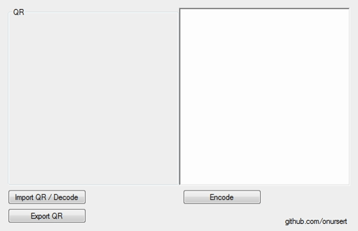

# QRDecodeEncode

QR Decode Encode (with MessagingToolkit.QRCode) - 2015 (C#)

QR Decode Encode is a tool for Windows PCs allows you to decode or encode QR codes.

The interface consists of a small screen that allows you to import QR code and decode it to text or enter text and encode and export it to QR code image. This app uses MessagingToolkit.QRCode for QR decode encode process.

QR Decode Encode doesn't require installation.

<a href="https://github.com/onursert/QRDecodeEncode/raw/master/QRDecodeEncode.zip">Download QR Decode Encode</a>
